# Архитектура системы закупки и продаж

Этот пакет документов фиксирует целевую архитектуру системы учета движения товара от закупки в Дагестане до продажи в Москве и регионах.

**Разработка и правила для агента:** в корне репозитория см. [`PROJECT_MASTER_SPEC.md`](../../PROJECT_MASTER_SPEC.md) и каталог [`.cursor/rules/`](../../.cursor/rules/).

## Состав архитектурного пакета

- `business-glossary.md` — словарь терминов, бизнес-правила и ключевые допущения.
- `processes/document-map.md` — карта документов, статусы, переходы и движения.
- `processes/roles-and-permissions.md` — роли, права, зоны ответственности.
- `data-model/er-model.md` — концептуальная ER-модель и связи сущностей.
- `data-model/table-catalog.md` — каталог таблиц, ключевых полей, индексов и ограничений.
- `offline/offline-sync.md` — офлайн-архитектура, синхронизация, конфликты, аудит.
- `ui/screen-flows.md` — экранные сценарии для web и mobile.
- `roadmap.md` — MVP, очереди внедрения, зависимости и критерии готовности.
- `processes/role-workflows-detailed.md` — пошаговые сценарии по ролям (закупщик → продавец), в связке с матрицей прав.
- `risks-and-guardrails.md` — риски (офлайн, долги, округления, возвраты) и как их закрываем.
- `data-model/units-and-precision.md` — граммы/копейки, без float как источника истины.

## Принцип проектирования

Система строится вокруг 4 базовых сущностей:

1. `Документы` — операционные и финансовые факты.
2. `Партии` — происхождение и себестоимость товара.
3. `Движения` — единый источник правды по остаткам.
4. `Рейсы и продажи` — логистика, реализация, долги и отчетность.

## Сквозной поток

```mermaid
flowchart LR
    purchase[Закупка] --> receipt[ПоступлениеНаСклад]
    receipt --> allocation[РаспределениеПоКачествуИНаправлению]
    allocation --> shipment[ОтгрузкаВРейс]
    shipment --> acceptance[ПриемкаРейса]
    acceptance --> sellerStock[ОстатокУПродавца]
    sellerStock --> sale[Продажа]
    sale --> receivable[ДолгИлиОплата]
    receivable --> report[ИтогПоРейсу]
```

## Технологический контур

- `Web Admin` для офиса и управленцев.
- `Mobile App/PWA` для закупщиков, кладовщиков, приемщиков и продавцов.
- `Backend API` как единый слой бизнес-логики.
- `PostgreSQL` как основная база данных.
- `Object Storage` для фото накладных и актов.
- `Background Jobs` для синхронизации, уведомлений и пересчета агрегатов.
- `Offline Sync Layer` для работы без устойчивого интернета.

## Базовые ограничения

- Учет ведется одновременно в `кг` и `ящиках`.
- Продажа всегда опирается на подтвержденный остаток.
- Продажа в долг невозможна без идентифицированного клиента.
- Любое изменение остатков оформляется документом и создает движение.
- Офлайн поддерживается с первого релиза архитектуры, а не как надстройка.
