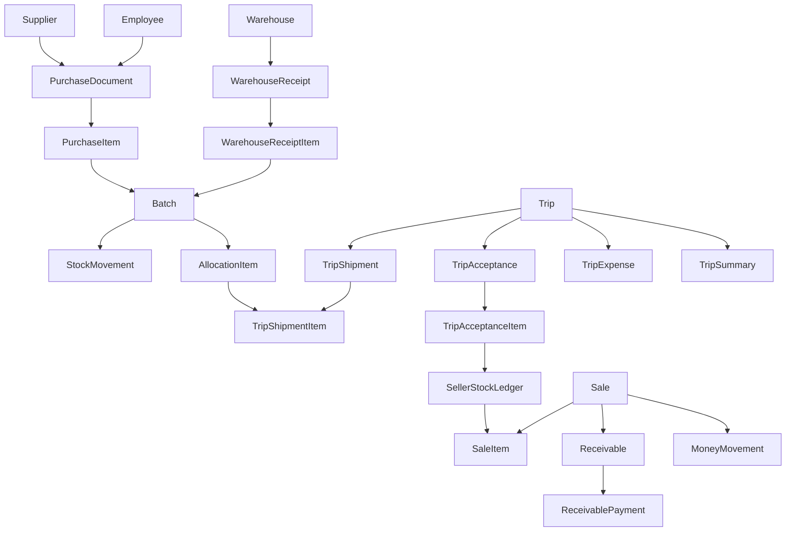

# Концептуальная ER-модель

## Цель

Зафиксировать ядро доменной модели, на которой будет строиться база данных, API и учетные правила.

## Главный принцип

Система делится на 5 связанных доменов:

1. `Справочники`
2. `Закупка и партии`
3. `Склад и движения`
4. `Логистика и продажи`
5. `Финансы и отчетные агрегаты`

## Концептуальная схема

## Домен 1. Справочники

### Основные сущности

- `users`
- `roles`
- `employees`
- `suppliers`
- `customers`
- `warehouses`
- `regions`
- `markets`
- `vehicles`
- `routes`
- `products`
- `productVariants`
- `grades`
- `qualityClasses`
- `destinationChannels`
- `packagingTypes`
- `expenseTypes`
- `writeOffReasons`

### Нормализация справочников

- `products` хранит базовый товар
- `productVariants` хранит коммерческую комбинацию признаков
- `grades` хранит размер или калибр
- `qualityClasses` хранит оценку качества
- `destinationChannels` хранит бизнес-направление

`productVariants` не должны дублировать смысл справочников, а должны ссылаться на них.

## Домен 2. Закупка и партии

### PurchaseDocument
Шапка закупочной накладной.

Ключевые поля:
- `id`
- `documentNumber`
- `documentDate`
- `supplierId`
- `purchaserEmployeeId`
- `warehouseId`
- `status`
- `additionalExpensesAmount`
- `totalAmount`

### PurchaseItem
Строки закупочного документа.

Ключевые поля:
- `id`
- `purchaseDocumentId`
- `productVariantId`
- `qualityClassId`
- `qtyKg`
- `qtyBoxes`
- `purchasePrice`
- `lineAmount`

### Batch
Отслеживаемая партия товара.

Ключевые поля:
- `id`
- `purchaseItemId`
- `originWarehouseId`
- `productVariantId`
- `qualityClassId`
- `destinationChannelId`
- `initialQtyKg`
- `initialQtyBoxes`
- `remainingQtyKgSnapshot`
- `remainingQtyBoxesSnapshot`
- `costAmount`
- `status`

### Принцип партии

Одна строка закупки может породить:
- одну партию, если товар однородный
- несколько подпартий, если после приемки или сортировки товар делится по качеству

Для этого у `batches` нужен `parentBatchId`.

## Домен 3. Склад и движения

### WarehouseReceipt
Факт поступления на склад.

### Allocation
Универсальный документ перераспределения партии по качеству или направлению.

Поля:
- `allocationType` со значениями `quality`, `destination`, `reserve`, `regrade`

### StockMovement
Главный источник правды по остаткам.

Ключевые поля:
- `id`
- `movementDate`
- `documentType`
- `documentId`
- `batchId`
- `movementType`
- `storageContextType`
- `storageContextId`
- `qtyKgDelta`
- `qtyBoxesDelta`
- `costDelta`
- `qualityClassId`
- `destinationChannelId`

### Контексты хранения

`storageContextType`:
- `warehouse`
- `trip_in_transit`
- `seller`
- `vehicle`
- `reserve`
- `writeoff`

Это позволяет одной таблицей движения покрывать все точки учета.

## Домен 4. Логистика и продажи

### Trip
Жизненный цикл фуры и маршрута.

Ключевые поля:
- `id`
- `tripNumber`
- `routeId`
- `vehicleId`
- `driverName`
- `departureWarehouseId`
- `plannedDepartureAt`
- `actualDepartureAt`
- `actualArrivalAt`
- `status`

### TripShipment
Шапка документа отгрузки в рейс.

### TripShipmentItem
Строки отгрузки.

Поля:
- `tripShipmentId`
- `batchId`
- `qtyKg`
- `qtyBoxes`
- `costAmount`

### TripAcceptance
Шапка приемки рейса.

### TripAcceptanceItem
Строки приемки.

Поля:
- `tripAcceptanceId`
- `tripShipmentItemId`
- `batchId`
- `acceptedQtyKg`
- `acceptedQtyBoxes`
- `shortageQtyKg`
- `shortageQtyBoxes`
- `excessQtyKg`
- `excessQtyBoxes`

### SellerStockLedger
Представление или физическая таблица для быстрого доступа к подтвержденным остаткам продавца.

Если это таблица, она должна обновляться из `stockMovements`.

### Sale
Шапка продажи.

Ключевые поля:
- `id`
- `saleNumber`
- `saleDateTime`
- `sellerEmployeeId`
- `tripId`
- `marketId`
- `customerId`
- `saleType`
- `paymentType`
- `totalAmount`
- `paidAmount`
- `debtAmount`

### SaleItem
Строки продажи.

Ключевые поля:
- `saleId`
- `batchId`
- `productVariantId`
- `qtyKg`
- `qtyBoxes`
- `salePrice`
- `lineAmount`

### Customer
Карточка клиента для опта и долгов.

Обязательные поля:
- `name`
- `phone`
- `customerType`
- `marketId`
- `creditLimit`

## Домен 5. Финансы и отчетность

### Receivable
Обязательство клиента по продаже в долг.

Ключевые поля:
- `id`
- `saleId`
- `customerId`
- `originalAmount`
- `paidAmount`
- `remainingAmount`
- `dueDate`
- `status`

### ReceivablePayment
Платеж в счет долга.

Ключевые поля:
- `receivableId`
- `paymentDate`
- `paymentAmount`
- `paymentMethod`
- `receivedByEmployeeId`

### MoneyMovement
Движение денег.

Ключевые поля:
- `id`
- `movementDate`
- `documentType`
- `documentId`
- `direction`
- `amount`
- `paymentMethod`
- `tripId`
- `customerId`

### Expense
Расходы по закупке, рейсу и операционной деятельности.

Ключевые поля:
- `expenseScopeType`
- `expenseScopeId`
- `expenseTypeId`
- `amount`

### TripSummary
Агрегированная витрина по рейсу.

Поля:
- `tripId`
- `shippedQtyKg`
- `acceptedQtyKg`
- `soldQtyKg`
- `remainingQtyKg`
- `revenueAmount`
- `receivableAmount`
- `paidAmount`
- `expenseAmount`
- `estimatedMargin`

## Важные связи и кардинальности

- один `purchaseDocument` имеет много `purchaseItems`
- один `purchaseItem` может породить много `batches`
- один `batch` участвует во многих `stockMovements`
- один `trip` имеет много `tripShipments`
- один `tripShipment` имеет много `tripShipmentItems`
- один `trip` имеет много `tripAcceptances`
- одна `sale` имеет много `saleItems`
- одна `sale` может иметь ноль или один `receivable`
- один `receivable` имеет много `receivablePayments`

## Модель хранения остатка

Рекомендуется 2 уровня:

1. `stockMovements` — неизменяемый журнал движений
2. `stock_balance_snapshots` — материализованный срез для быстрого чтения

`stock_balance_snapshots` должен пересчитываться из движений и не быть единственным источником правды.

## Обязательные ограничения

- `qtyKg` и `qtyBoxes` не могут быть одновременно нулевыми
- `remainingAmount >= 0`
- `paidAmount <= originalAmount`
- `sale.totalAmount = sum(saleItems.lineAmount)` на уровне сервиса или БД
- `tripAcceptanceItem.accepted + shortage - excess` должно соответствовать бизнес-правилу приемки
- `stockMovements` должен быть только append-only, кроме служебной пометки отмены

## Отчетные витрины

Для быстрого построения отчетов рекомендуется выделить материализованные представления:

- `mv_stock_by_warehouse`
- `mv_stock_by_trip`
- `mv_stock_by_seller`
- `mv_sales_by_day`
- `mv_receivables_open`
- `mv_trip_profitability`

## Минимальный технический вывод

Если база данных и backend будут спроектированы вокруг `batches`, `stockMovements`, `trips`, `sales`, `receivables`, то вся остальная система сможет безопасно расширяться без ломки архитектуры.
