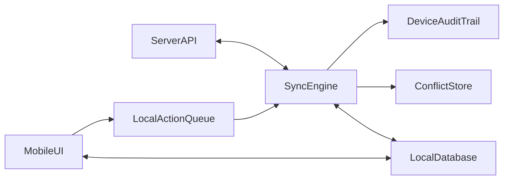
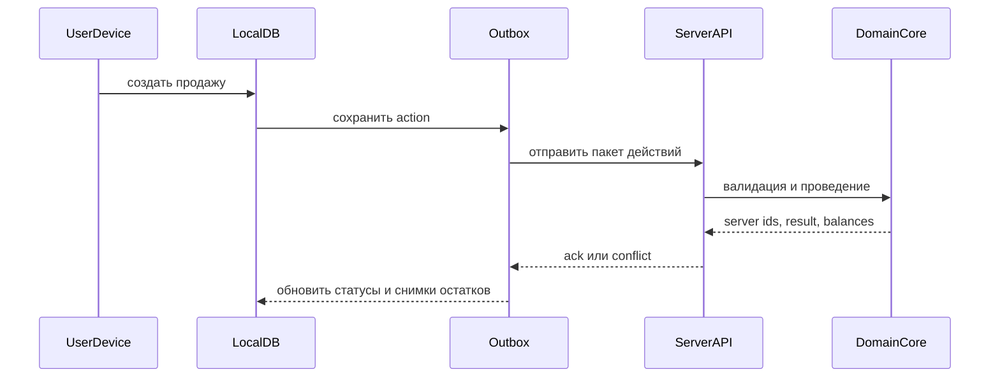

# Офлайн-архитектура и синхронизация

## Цель

Обеспечить устойчивую работу продавцов, кладовщиков и приемщиков при нестабильном интернете без потери учетной целостности.

## Основной принцип

Мобильный клиент должен уметь:
- читать локально сохраненные данные
- создавать новые действия без сети
- сохранять их как события
- позже синхронизировать их на сервер

Сервер должен оставаться единственным местом окончательной истины, но локальный клиент должен обеспечивать непрерывность работы.

## Что должно работать офлайн

### Для продавца
- просмотр выданных остатков
- просмотр открытых долгов своих клиентов
- создание продажи
- создание продажи в долг
- регистрация оплаты долга
- оформление списания
- прикрепление фото и комментариев

### Для приемщика
- просмотр отгрузки по рейсу
- создание приемки
- фиксация расхождений
- прикрепление фото повреждений

### Для кладовщика
- просмотр подготовленных заданий на погрузку
- подтверждение факта погрузки по заранее синхронизированным данным

## Что запрещено делать полностью автономно

- изменять справочники
- закрывать рейс окончательно
- проводить инвентаризацию с глобальной корректировкой
- менять уже синхронизированные и закрытые документы
- превышать локально подтвержденный остаток

## Архитектура офлайн-клиента

## Локальные сущности

На устройстве нужно хранить только рабочий минимум.

### Справочники
- пользователи текущего контекста
- товары и варианты
- клиенты продавца
- рынки
- причины списания
- способы оплаты

### Операционные данные
- активные рейсы пользователя
- подтвержденные остатки продавца
- открытые долги его клиентов
- документы, созданные локально и еще не синхронизированные
- история последних синхронизаций

## Локальная модель хранения

Рекомендуется хранить:
- `local_entities`
- `local_actions`
- `local_sync_state`
- `local_conflicts`
- `local_attachments`

### `local_actions`
Каждое действие сохраняется как неизменяемое событие.

Поля:
- `localActionId`
- `deviceId`
- `actionType`
- `entityType`
- `localEntityId`
- `payloadJson`
- `createdAt`
- `syncStatus`
- `serverEntityId`

## Подход к синхронизации

Использовать стратегию `outbox/inbox`.

### Outbox
Локально созданные действия попадают в очередь исходящих событий.

### Inbox
Сервер возвращает:
- подтвержденные идентификаторы
- обновления по остаткам
- обновления по долгам
- конфликты
- новые справочники

## Поток синхронизации

## Стратегия идентификаторов

### На клиенте
- локальные UUID для всех новых сущностей
- локальные номера документов могут быть временными

### На сервере
- глобальные UUID
- финальные номера документов присваиваются сервером или централизованным генератором

### Маппинг
Нужна таблица сопоставления:
- `deviceLocalId`
- `serverEntityId`
- `entityType`

## Политика конфликтов

Конфликты неизбежны, особенно по остаткам и долгам.

### Типы конфликтов

1. `stale_balance`
Клиент пытался продать больше, чем осталось после серверной синхронизации.

2. `entity_changed`
Документ или клиент были изменены на сервере после последнего обновления устройства.

3. `duplicate_submit`
Одно и то же действие отправлено повторно.

4. `forbidden_transition`
Клиент пытается провести документ в недопустимый статус.

5. `credit_limit_exceeded`
Продажа в долг превышает лимит клиента.

## Правила разрешения конфликтов

### Автоматически
- дубликаты отбрасываются по `idempotency key`
- повторная отправка уже подтвержденного действия возвращает `ack`
- устаревший справочник заменяется серверной версией

### Требуют вмешательства пользователя
- продажа сверх остатка
- приемка с критическим расхождением
- оплата долга по закрытому или измененному долгу

### Требуют вмешательства офиса
- ретро-изменение закрытого рейса
- конфликт по партии после инвентаризации

## Политика идемпотентности

Каждое действие должно отправляться с:
- `deviceId`
- `localActionId`
- `entityType`
- `actionType`

Сервер обязан хранить журнал обработанных ключей и не создавать дублей при повторной доставке.

## Правила локальной валидации

Перед сохранением действия без сети клиент обязан проверить:
- есть ли локальный остаток
- не превышает ли продажа остаток
- выбран ли клиент для долга
- не превышен ли локально известный лимит долга
- заполнены ли обязательные поля документа

Локальная валидация не заменяет серверную.

## Правила серверной валидации

Сервер при приеме офлайн-действий проверяет:
- корректность статуса документа
- фактический остаток на момент проведения
- право пользователя на контекст
- наличие связанного рейса или продавца
- целостность партии и источника остатка

## Снимки данных для офлайна

Чтобы ускорить работу, сервер должен отдавать устройству компактные срезы:
- активные рейсы пользователя
- подтвержденные остатки по партиям
- список клиентов и открытых долгов
- базовые справочники

Снимки должны иметь:
- `snapshotVersion`
- `generatedAt`
- `expiresAt`

## Обновление вложений

Фото и файлы передаются отдельно от бизнес-документа.

### Подход
- сначала сохраняется локальная запись вложения
- при появлении сети файл загружается в хранилище
- затем документ получает серверный `attachmentId`

Если файл еще не синхронизирован, документ должен показываться как `posted_with_pending_attachment` или аналогичным статусом клиента.

## Аудит и трассировка

Каждое офлайн-действие должно оставлять след:
- `deviceId`
- версия приложения
- локальное время устройства
- серверное время приема
- пользователь
- геоконтекст при необходимости

Это нужно для разбора спорных продаж и расхождений по приемке.

## Рекомендованные технические решения

### Клиент
- `SQLite` или аналог локальной БД
- очередь действий `outbox`
- фоновые попытки синхронизации
- ручная кнопка `Синхронизировать`

### Сервер
- endpoint пакетной синхронизации
- идемпотентная обработка
- журнал конфликтов
- инкрементальные ответы по изменившимся данным

## Границы ответственности офлайна

Офлайн-клиент отвечает за:
- сбор и временное хранение данных
- первичную проверку формы
- повторные отправки

Сервер отвечает за:
- окончательную проверку бизнес-правил
- присвоение финальных идентификаторов
- создание движений
- обновление отчетов
- финальное разрешение конфликтов

## Критические защитные меры

- запрет продажи сверх локально подтвержденного остатка
- хранение локальной версии снимка остатков
- серверная идемпотентность
- аудит по устройству и пользователю
- отдельный журнал конфликтов
- автоматическая блокировка старых версий приложения при несовместимых изменениях синка

## Минимальный офлайн-контур для MVP

Первая версия обязана поддерживать:
- приемку продавцом офлайн
- продажи офлайн
- долги офлайн
- оплаты долгов офлайн
- последующую синхронизацию остатков и долгов

Погрузку на складе можно оставить с ограниченным офлайном, если на складе интернет стабильнее, чем на рынке.
