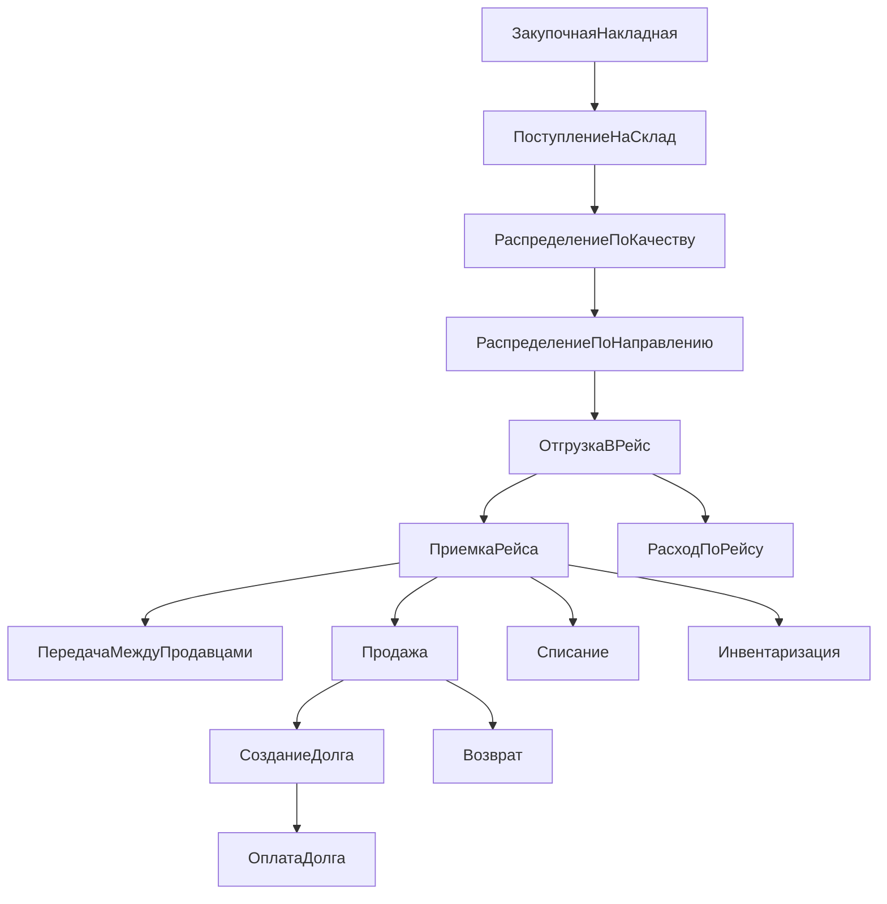

# Карта документов, статусов и движений

## Назначение

Этот документ описывает полный набор операционных и финансовых документов, обязательные поля, связи между ними и то, какие движения они создают.

## Документный принцип

Каждый документ проходит 2 уровня фиксации:

1. `Подтверждение` — пользователь заверяет содержимое документа.
2. `Проведение` — система создает движения по остаткам, деньгам, долгам или статусам.

Без проведения документ не влияет на учет.

## Общая цепочка документов

## Базовый жизненный цикл документа

Стандартные статусы:
- `draft`
- `confirmed`
- `posted`
- `partially_completed`
- `closed`
- `cancelled`

### Общие правила переходов

- `draft -> confirmed`
- `confirmed -> posted`
- `posted -> partially_completed` при частичном исполнении
- `posted -> closed` при полном завершении
- `draft -> cancelled`
- `confirmed -> cancelled`, если движения еще не созданы

Изменение `posted` документа напрямую запрещено. После проведения допускаются только:
- корректирующий документ
- отмена с созданием обратных движений
- специальный административный сценарий по аудируемой процедуре

## 1. Закупочная накладная

### Назначение
Фиксирует факт закупки у поставщика или через закупщика.

### Обязательные поля шапки
- `documentNumber`
- `documentDate`
- `supplierId`
- `buyerCompanyId`
- `purchaserEmployeeId`
- `warehouseId`
- `currency`
- `additionalExpensesAmount`
- `totalAmount`
- `sourcePhotoAttachmentId`

### Обязательные поля строки
- `lineNo`
- `productId`
- `productVariantId`
- `gradeId`
- `qualityClassId`
- `packageTypeId`
- `qtyKg`
- `qtyBoxes`
- `purchasePricePerKgOrBox`
- `lineAmount`

### Связи
- создает `purchaseItems`
- является основанием для `warehouseReceipt`
- может создавать `batches` после подтвержденного поступления

### Проводки и движения
- сама по себе может не менять остатки, если поступление оформляется отдельным документом
- фиксирует финансовое обязательство перед поставщиком при необходимости

## 2. Поступление на склад

### Назначение
Подтверждает фактическое зачисление закупленного товара на склад.

### Обязательные поля шапки
- `receiptNumber`
- `receiptDate`
- `warehouseId`
- `purchaseDocumentId`
- `receivedByEmployeeId`

### Обязательные поля строки
- `purchaseItemId`
- `batchId`
- `qtyKgAccepted`
- `qtyBoxesAccepted`
- `acceptedQualityClassId`
- `comment`

### Связи
- опирается на `purchaseDocument`
- создает или активирует `batch`
- создает `stockMovements`

### Движения
- `+складской остаток`
- `+доступный остаток партии`

## 3. Распределение по качеству

### Назначение
Фиксирует пересмотр качества после поступления или сортировки.

### Когда нужен
- товар фактически отличается от заявленного качества
- часть партии нужно перевести в слабый товар или брак
- товар делится на несколько качественных подгрупп

### Обязательные поля
- `allocationDate`
- `warehouseId`
- `sourceBatchId`
- `sourceQualityClassId`
- `performedByEmployeeId`

### Строки
- `targetBatchId`
- `targetQualityClassId`
- `qtyKg`
- `qtyBoxes`
- `reasonCode`

### Движения
- `-остаток исходной партии`
- `+остаток новых или скорректированных подпартий`

## 4. Распределение по направлению

### Назначение
Разделяет доступный остаток на каналы: Москва, регионы, уценка, списание.

### Обязательные поля
- `allocationDate`
- `warehouseId`
- `sourceBatchId`
- `destinationChannelId`
- `performedByEmployeeId`

### Строки
- `qtyKg`
- `qtyBoxes`
- `targetDestinationChannelId`
- `comment`

### Движения
- перевод между аналитическими остатками без смены склада
- формирование резерва под конкретное направление

## 5. Задание на погрузку

### Назначение
Подготовительный документ для логиста и склада до финальной отгрузки.

### Обязательные поля
- `tripId`
- `warehouseId`
- `loadingDate`
- `vehicleId`
- `driverId`
- `plannedDepartureAt`
- `responsibleEmployeeId`

### Строки
- `batchId`
- `plannedQtyKg`
- `plannedQtyBoxes`

### Движения
- не создает фактический расход
- может создавать временный резерв

## 6. Отгрузка в рейс

### Назначение
Списывает товар со склада и закрепляет его за рейсом.

### Обязательные поля шапки
- `shipmentNumber`
- `shipmentDate`
- `tripId`
- `warehouseId`
- `vehicleId`
- `driverId`
- `loadedByEmployeeId`

### Обязательные поля строки
- `batchId`
- `destinationChannelId`
- `qtyKgShipped`
- `qtyBoxesShipped`
- `costAmount`

### Связи
- переводит остаток со склада в рейс
- становится основанием для приемки

### Движения
- `-остаток склада`
- `+остаток в пути по рейсу`

## 7. Приемка рейса

### Назначение
Подтверждает фактическое получение товара в месте продажи или распределения.

### Обязательные поля шапки
- `acceptanceNumber`
- `acceptanceDate`
- `tripId`
- `acceptedByEmployeeId`
- `marketId`
- `sellerEmployeeId`

### Обязательные поля строки
- `shipmentItemId`
- `batchId`
- `qtyKgAccepted`
- `qtyBoxesAccepted`
- `qtyKgShortage`
- `qtyBoxesShortage`
- `qtyKgExcess`
- `qtyBoxesExcess`
- `acceptedQualityClassId`
- `discrepancyReasonCode`

### Движения
- `-остаток в пути`
- `+остаток продавца`
- `+акт расхождений`, если есть отклонения

## 8. Передача между продавцами

### Назначение
Перемещает остаток между продавцами или торговыми точками без возврата на склад.

### Обязательные поля
- `transferDate`
- `tripId`
- `fromSellerId`
- `toSellerId`
- `approvedByEmployeeId`

### Строки
- `batchId`
- `qtyKg`
- `qtyBoxes`

### Движения
- `-остаток продавца A`
- `+остаток продавца B`

## 9. Продажа

### Назначение
Фиксирует отпуск товара клиенту.

### Обязательные поля шапки
- `saleNumber`
- `saleDateTime`
- `sellerEmployeeId`
- `marketId`
- `tripId`
- `saleType`
- `paymentType`
- `customerId`, если опт или долг
- `totalAmount`
- `paidAmount`
- `debtAmount`

### Обязательные поля строки
- `batchId`
- `productVariantId`
- `qtyKg`
- `qtyBoxes`
- `salePrice`
- `lineAmount`

### Движения
- `-остаток продавца`
- `+денежное движение`, если есть оплата
- `+дебиторка`, если есть долг

### Бизнес-ограничения
- при `paymentType = credit` клиент обязателен
- продажа не может превышать доступный остаток продавца

## 10. Оплата долга

### Назначение
Фиксирует полную или частичную оплату ранее созданного долга.

### Обязательные поля
- `paymentDate`
- `receivableId`
- `customerId`
- `receivedByEmployeeId`
- `paymentMethod`
- `paymentAmount`

### Движения
- `+денежное движение`
- `-остаток дебиторки`

## 11. Возврат от клиента

### Назначение
Фиксирует возврат проданного товара или корректировку по спорной продаже.

### Обязательные поля
- `returnDate`
- `saleId`
- `customerId`
- `acceptedByEmployeeId`
- `reasonCode`

### Строки
- `batchId`
- `qtyKg`
- `qtyBoxes`
- `returnAmount`
- `returnDisposition`

### Возможные сценарии
- вернуть в остаток продавца
- отправить на списание
- отправить на уценку

### Движения
- `+остаток продавца` или `+уцененный остаток`
- `-денежное движение` при возврате денег

## 12. Списание

### Назначение
Снимает с учета товар, непригодный к дальнейшей продаже.

### Обязательные поля
- `writeOffDate`
- `responsibleEmployeeId`
- `storageContextType`
- `storageContextId`
- `reasonCode`

### Строки
- `batchId`
- `qtyKg`
- `qtyBoxes`
- `estimatedLossAmount`

### Движения
- `-остаток соответствующего контекста`

## 13. Инвентаризация

### Назначение
Сверяет учетный и фактический остаток по складу, рейсу или продавцу.

### Обязательные поля
- `inventoryDate`
- `contextType`
- `contextId`
- `performedByEmployeeId`

### Строки
- `batchId`
- `bookQtyKg`
- `bookQtyBoxes`
- `factQtyKg`
- `factQtyBoxes`
- `differenceReasonCode`

### Движения
- создает корректирующие движения только после подтверждения результатов

## 14. Расход по рейсу

### Назначение
Фиксирует логистические и сопутствующие затраты по конкретной фуре или рейсу.

### Обязательные поля
- `expenseDate`
- `tripId`
- `expenseType`
- `amount`
- `currency`
- `responsibleEmployeeId`

### Типы расходов
- топливо
- дорога
- погрузка
- разгрузка
- стоянка
- ремонт
- комиссия рынка
- прочее

### Движения
- `+финансовый расход`
- влияет на итоговую прибыль рейса

## Матрица: документ и учетные эффекты

| Документ | Остатки | Партии | Деньги | Долги | Статусы рейса |
| --- | --- | --- | --- | --- | --- |
| Закупочная накладная | Нет или косвенно | Подготавливает | Опционально | Нет | Нет |
| Поступление на склад | Да | Да | Нет | Нет | Нет |
| Распределение по качеству | Да | Да | Нет | Нет | Нет |
| Распределение по направлению | Да | Нет | Нет | Нет | Нет |
| Отгрузка в рейс | Да | Нет | Нет | Нет | Да |
| Приемка рейса | Да | Нет | Нет | Нет | Да |
| Передача между продавцами | Да | Нет | Нет | Нет | Нет |
| Продажа | Да | Нет | Да | Да | Нет |
| Оплата долга | Нет | Нет | Да | Да | Нет |
| Возврат | Да | Нет | Да | Да | Нет |
| Списание | Да | Нет | Нет | Нет | Нет |
| Инвентаризация | Да | Нет | Нет | Нет | Нет |
| Расход по рейсу | Нет | Нет | Да | Нет | Да |

## Документы, обязательные для MVP

- закупочная накладная
- поступление на склад
- распределение по направлению
- отгрузка в рейс
- приемка рейса
- продажа
- оплата долга
- списание
- расход по рейсу

## Документы второй очереди

- распределение по качеству с подпартиями
- передача между продавцами
- возврат от клиента
- инвентаризация
- корректирующие акты и причины расхождений
