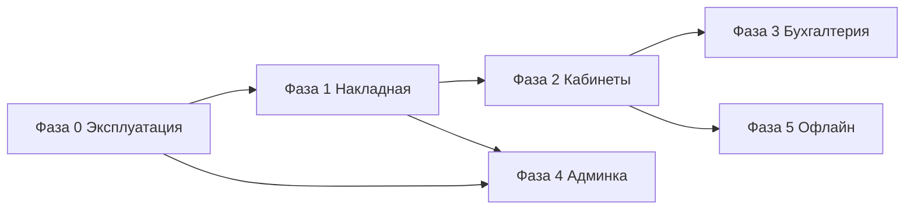

# План развития «Биржа» — дорожная карта

**Назначение:** единый ориентир на будущее: что делать по шагам, в каком порядке и зачем.  
**Как обновлять:** после каждого крупного этапа — править статусы и даты; не дублировать детали из `implementation-status.md`, а ссылаться на него.

---

## 1. Принципы (не менять без осознанного решения)

| Принцип | Смысл |
|--------|--------|
| **Первичка — накладная** | Учёт строится от **закупочной накладной** и справочников (склады, калибры/«виды» товара). Ручное создание партии в «Операциях» — дополнение, не главный путь. |
| **Справочники → документ** | Названия сортов/калибров и складов не вводятся «с клавиатуры каждый раз», а выбираются из каталога; накладная **собирается из данных**, а не из пустой формы. |
| **Роль видит свой контур** | То, что видит пользователь, должно соответствовать роли (склад, рейс, продажа, бухгалтерия). Скрытие вкладок — не замена проверок на API. |
| **Сначала надёжность** | HTTPS, бэкапы БД, разделение учёток — фундамент; без этого «красивые кабинеты» бессмысленны. |
| **Итерации, не big bang** | Каждый этап даёт проверяемую ценность; не пытаться выпустить «всё из документа screen-flows» за один раз. |

---

## 2. Откуда смотреть правду по коду

| Документ | Что там |
|----------|---------|
| [`docs/implementation-status.md`](../implementation-status.md) | Что уже сделано в репозитории (API, веб, миграции). |
| [`docs/architecture/ui/screen-flows.md`](../architecture/ui/screen-flows.md) | Целевые экраны и роли (черновик под заказчика). |
| [`docs/architecture/processes/roles-and-permissions.md`](../architecture/processes/roles-and-permissions.md) | Матрица прав по документам. |
| [`docs/testing/golden-scenario.md`](../testing/golden-scenario.md) | Сквозной сценарий проверки сходимости. |

---

## 3. Картина «сейчас» (кратко)

- **Есть:** домен учёта (партии, рейсы, накладная → партии, отгрузка, продажа, недостача, отчёт по рейсу), вход JWT, фильтр вкладок по ролям, офлайн-очередь, справочник контрагентов, API под `REQUIRE_API_AUTH`.
- **Слабые места:** нет полноценного **«проекта от накладной»** в UX (первый экран не про накладную); **бухгалтерский** контур в UI минимален; **отдельных кабинетов** по ролям как в доках нет; **админка пользователей** в интерфейсе отсутствует (создание через CLI).

Ниже план выводит продукт к целевой модели по шагам.

---

## 4. Фазы плана

### Фаза 0 — Эксплуатация и доверие к данным

**Цель:** сервер и данные не теряются, доступ контролируется.

| Шаг | Действие | Критерий готовности |
|-----|----------|---------------------|
| 0.1 | Домен + **HTTPS** (Let’s Encrypt), при необходимости правка nginx | Сайт открывается по `https://`, cookie сессии работают предсказуемо. |
| 0.2 | **Резервное копирование** PostgreSQL (cron, `pg_dump` или инструмент провайдера) | Есть файл бэкапа за сегодня; один раз проверено восстановление на копии. |
| 0.3 | Учётные записи **не только admin**: роли `warehouse`, `seller`, `accountant` и т.д. по матрице | Можно войти под типовым пользователем и увидеть «свои» вкладки. |
| 0.4 | Зафиксировать **регламент паролей** и смены `JWT_SECRET`/паролей при утечке | Короткий внутренний чеклист (можно в `docs/deployment/runbook.md`). |

---

### Фаза 1 — Накладная как центр сценария (продукт + UX)

**Цель:** пользователь по умолчанию ведёт учёт **от накладной**, справочники поддерживают «сборку» документа.

| Шаг | Действие | Критерий готовности |
|-----|----------|---------------------|
| 1.1 | **Продуктовая фиксация:** один экран-тезис «первичка = накладная» + схема потока (накладная → партии → рейс → продажи) | Запись в `docs/` (этот файл или отдельный `product-flow.md`), согласовано с заказчиком. |
| 1.2 | **Дефолт после входа** для ролей закупа/склада: первый экран — **мастер накладной** или вкладка «Накладная» с приоритетом в навигации | Поведение `defaultRouteForUser` / стартовый маршрут обновлены. |
| 1.3 | Усилить форму накладной: подсказки по **калибру**, проверка суммы строки, явная связь «строка → партия» в тексте UI | Меньше ошибок ввода; пользователь понимает результат кнопки «Создать». |
| 1.4 | Справочники **склады / калибры**: при необходимости — админский **просмотр** списков (read-only из UI) или страница «Справочники» без полного CRUD | Закуп видит актуальные коды без лезания в БД. |
| 1.5 | Связка **Операции** ↔ **Накладная:** в тексте и ссылках явно: «партия из накладной» vs «ручная партия» | Снижается ощущение «разбросанности». |

---

### Фаза 2 — Кабинеты по ролям (навигация и контент)

**Цель:** не одна каша вкладок, а **понятный контур** для склад/логист/продавец.

| Шаг | Действие | Критерий готовности |
|-----|----------|---------------------|
| 2.1 | Согласовать **упрощённую матрицу** «роль → главный экран → скрыто» (1 страница) | Подпись заказчика или внутреннее решение. |
| 2.2 | Ввести **маршруты-заглушки** или секции: `/sklad`, `/reysy` как обёртки над существующими формами | Пользователь по роли попадает в «свой» блок без лишних вкладок. |
| 2.3 | **Фильтрация данных** там, где в БД есть привязка (склад, зона рейсов) — поэтапно, начиная с самого болезненного расхождения | Минимум «вижу чужие рейсы», если бизнес это запрещает. |
| 2.4 | PWA/мобильный сценарий для продавца/приёмщика — **после** стабилизации web-контуров | См. `screen-flows` (приоритет PWA для поля). |

---

### Фаза 3 — Бухгалтерия и финансы в интерфейсе

**Цель:** раздел бухгалтера не «сырой заглушкой», а **сводами и проверками**.

| Шаг | Действие | Критерий готовности |
|-----|----------|---------------------|
| 3.1 | Список **продаж / долгов** по рейсам и периоду (read-only агрегаты из уже существующих данных отчёта) | Бухгалтер не лезет в «Операции» за цифрами. |
| 3.2 | Экспорт в **Excel/CSV** для сверки (расширение уже имеющегося CSV по партиям). | |
| 3.3 | **Оплаты долга** (если появится в домене) — только после одного бизнес-правила из `risks-and-guardrails` | Не дублировать противоречивые сценарии. |
| 3.4 | Отчётность для налогов/управленки — **после** стабильности первички | Зависит от требований заказчика. |

---

### Фаза 4 — Администрирование системы

**Цель:** не только SSH и `create-user`.

| Шаг | Действие | Критерий готовности |
|-----|----------|---------------------|
| 4.1 | UI: **список пользователей** + назначение **глобальных ролей** (через API + проверки `admin`) | Админ не зависит от разработчика для типовых учёток. |
| 4.2 | Журнал **аудита** критичных действий (опционально, позже) | Требует модели событий в БД. |
| 4.3 | Управление **справочниками** (склады, калибры) из UI — когда объём изменений это оправдывает | Сейчас часть данных сидируется миграциями. |

---

### Фаза 5 — Углубление офлайна и синхронизации

**Цель:** полевые сценарии без потери данных.

| Шаг | Действие | Критерий готовности |
|-----|----------|---------------------|
| 5.1 | Контроль **очереди** и сообщений об ошибках для продавца в поле | Понятно, что отложено и почему. |
| 5.2 | Докрутка **идемпотентности** и конфликтов — по `risks-and-guardrails` | |
| 5.3 | Кеш остатков у продавца — **после** стабильного sync | См. `implementation-status`, этап «углубление продавца». |

---

## 5. Зависимости между фазами

- **Фаза 0** не блокирует разработку фич, но **блокирует честный пилот в проде**.  
- **Фаза 1** логически предшествует «красивым кабинетам» (фаза 2): иначе разносим сырой UX по ролям.  
- **Фаза 3** опирается на уже стабильные **отчёты и продажи** (уже есть в API).  
- **Фаза 4** можно частично вести **параллельно** с фазой 1 (отдельные люди: инфра/продукт vs разработка).

---

## 6. Рекомендуемый порядок на ближайшие спринты (шаблон)

| Спринт | Фокус | Результат |
|--------|--------|-----------|
| **1** | Фаза 0.1–0.2 + продуктовая запись по фазе 1.1 | HTTPS, бэкапы, зафиксированный поток «накладная первая». |
| **2** | Фаза 1.2–1.3 | Стартовый экран и понятная накладная. |
| **3** | Фаза 2.1–2.2 | Матрица ролей и первые «кабинеты»-обёртки. |
| **4** | Фаза 3.1–3.2 | Бух. сводка + экспорт. |
| **5** | Фаза 4.1 | Пользователи в UI для админа. |

Длительность спринта подставьте сами (1–2 недели обычно достаточно для таких шагов при одном разработчике).

---

## 7. Чеклист согласования с заказчиком

Перед крупными вложениями в UI имеет смысл получить ответы:

- [ ] Первичный документ — **только накладная** или допускается завод партии без неё в каких случаях?  
- [ ] **Калибры/виды** — фиксированный справочник или нужны частые правки из интерфейса?  
- [ ] **Бухгалтер**: достаточно сводов и CSV или нужен задел под проводки/НДС?  
- [ ] **Полевой контур** (продавец/приёмщик): обязателен в следующем квартале или позже?

---

## 8. История изменений документа

| Дата | Изменение |
|------|-----------|
| 2026-04-18 | Первая версия дорожной карты. |

---

*Этот план — живой документ: дополняйте датами завершения фаз и ссылками на PR/релизы по мере движения.*
